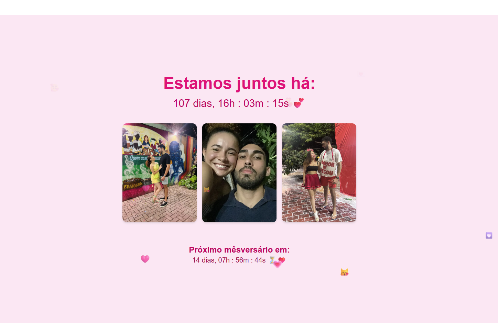

# 💖 Happy Love Days

🌸 Um site especial que celebra cada dia de amor entre Gabriel e Renata, com contador ao vivo, fotos e animações fofas de corações flutuantes.

> 🗓️ Juntos desde **01/03/2025**  
> 🥰 Este projeto foi feito com muito carinho, como presente digital para o nosso relacionamento.

---

## ✨ Funcionalidades

- ⏳ **Contador ao vivo** de dias, horas, minutos e segundos juntos
- 🗓️ **Contagem regressiva** para o próximo mêsversário
- 🖼️ **Galeria de fotos** do casal
- 💞 **Corações flutuantes animados** com variação de emoji, posição, rotação e velocidade
- 📱 **Responsivo**: funciona lindamente em mobile e desktop

---

## 🛠️ Tecnologias utilizadas

- [Next.js 14](https://nextjs.org/)
- [React](https://react.dev/)
- [Tailwind CSS](https://tailwindcss.com/)
- [TypeScript](https://www.typescriptlang.org/)
- [Vercel](https://vercel.com/) (para deploy)

---

## 🔗 Acesse o site

👉 [https://happylovedays.vercel.app](https://happylovedays.vercel.app)

---

## 📁 Estrutura de diretórios

```
📦app
┣ 📂components
┃ ┣ 📄floating-hearts.tsx
┃ ┣ 📄love-header.tsx
┃ ┣ 📄photo-grid.tsx
┃ ┗ 📄countdown-footer.tsx
┣ 📂utils
┃ ┣ 📄constants.ts
┃ ┗ 📄love-counter.ts
┣ 📄page.ts
```

---

## 💡 Próximas ideias

- 🎵 Música de fundo romântica
- 🖼️ Álbum interativo com legendas
- 🗓️ Linha do tempo com datas especiais
- 🌙 Tema noturno (modo lua de mel)

---

## 🤍 Agradecimentos

Feito com todo amor por Gabriel, para minha linda namorada Renata 💘  
Você faz todos os dias valerem a pena 💐

---

## 🖼️ Screenshot



---

## 📜 Licença

Este projeto é pessoal e feito com fins românticos. Mas sinta-se à vontade para se inspirar 💞
